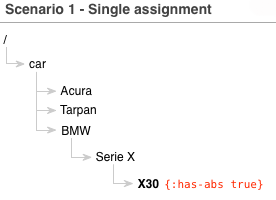
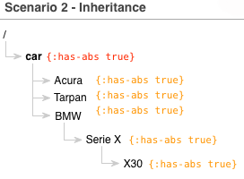
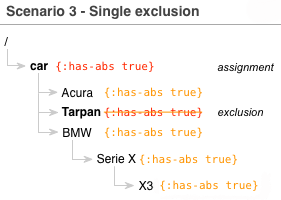
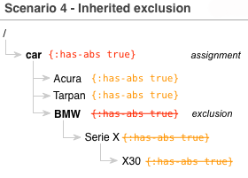

[](https://clojars.org/mbuczko/categorizer)

# Category tree manager

This is a rough attempt to create versatile category manager which would be simple to understand and powerful enough to handle different scenarios.
What are all those categories and where the problem actually arises?

Categories are everywhere. We use them to classify things, enclose same features into named groups which usually have their own subgroups which in turn have their own subgroups and so on.
One of the real world examples are cars. We split them by function they were built for (eg. trucks, agriculturals...), by make (BMW, VW), by model or serie.
It's natural to visualize all categories together as a deeply nested tree. In case of car we may imagine categories as a tree with following levels:

    car -> make -> serie -> model

for example:

    car -> BMW -> Serie X -> X3

Alright, but having categories with no parameters assigned is simply useless. Each category has its own set of parameters which in case of cars decide why we prefer Tarpan over BMW ;)
Parameters may be exactly the same for several categories (eg. most of cars have an ABS today), may be unique for one category or be excluded from the other. This is where the scenarios mentioned earlier come onto scene.

If we try to assign parameters in the most naive may - one by one for each category separately, it may succeed for a small amount of categories. It will fail painfully for cars (with roughly 5k of makes and models).

Let's visualize it as a _Scenario 1_:



We have a simplified tree of cars with 3 makes and BMW X3 is a sneaky one having ABS in a standard. Assigning ```:has-abs``` parameter was trivial, but one day your Pointy Haired Boss announces:

> _Huston, we have a problem. Acura, Tarpan and all 3000 of makes we store have ABS-es as well!_

Good luck with trying to assign parameters by hand. This is where we switch to _Scenario 2_:



The idea behind is simple - if all our cars have ABS-es, instead of crazy assigning ```:has-abs``` separately for each make and models, let's assign it once for _car_ node and mark it as _inherited_, which would make it assigned for all the nodes below by default.
In other words all the makes and models will _inherit_ parameter from their parent node and do not need explicit assignment.

That's how our fantasy world look like. In fact Tarpans have no ABS-es (but hey, they still have some other nice stuff inside!). Surely, they're exception but it doesn't mean that we have to switch back to _Scenario 1_. Instead let's examine _Scenario 3_:



Yup, simple like this. We still keep inherited ```:has-abs``` at top but additionally we marked Tarpans as an exception which should have ```:has-abs``` excluded. This way we avoid _Scenario 1_ with separate assignments still having nice way to exclude parameter from certain nodes.

Now, let's imagine for a moment that BMW is the make with no ABS-es under the hood (looking at some BMW drivers it's not as hard to imagine that). BMW has lot of series and models which would make us exclude parameter multiple times (if we followed _Scenario 3_). Fortunatelly, it could be simplfied again. Let's welcome _Scenario 4_ - the last one.



That's right - we're using inheritance again, this time to make exclusion easier. Instead of assigning exluded ```:has-abs```  to each BMW subnode, we may do it once (at BMW level) and mark exclusion as inherited. That means, all the subnodes have no ABS-es by default with no explicit exclusions made before.

#Details

We have 4 scenarios of how parameters can be assigned to tree nodes to save us a time and precious resources. Let's go deeper into details then.
4 scenarios mean 2 boolean flags we should use. I named them ```sticky``` and ```excluded```. Here is how they fit into our story:

- when a single parameter is assigned (_Scenario 1_) no flag is necessary
- when a inherited parameter is assigned (_Scenario 2_) a ```sticky``` flag should be used (we want paramter to "stick" to all the nodes down)
- when a parameter is excluded (_Scenario 3_) an ```excluded``` flag should be used
- when a parameter is excluded and exclusion is inherited - ```sticky``` and ```excluded``` flags should be used together

Easy peasy. The theory part is over :)


#Example

Let's define our tree first. Each parameter (like ```:price```, ```:type``` or ```status```) is a simple map containing ```:sticky``` and/or ```:excluded``` flags if necessary. Also, to avoid deep nesting each node contains a ```:path``` which is directory-like (slash separated) absolute path of node in our tree. This
way we may keep our tree definition flat and more readable.

``` clojure
(require '[mbuczko.category.tree :refer :all])

(def categories
  [{:path "/"
    :params {:status {:sticky true :value "available"}}}
   {:path "/car"
    :params {:condition {:sticky true :value "functioning"}
             :has-abs {:sticky true :version "standard"}}}
   {:path "/car/Tarpan"
    :params {:has-abs {:excluded true}}},
   {:path "/car/Acura"
    :params {:has-alarm {:sticky true :version "standard"}}}
   {:path "/car/BMW"
    :params {:has-xenons {:sticky true :version "extended"}}}
   {:path "/car/BMW/Serie X"
    :params {:has-xenons {:excluded true}}}
   {:path "/car/BMW/Serie X/X3"
    :params {:has-sunroof {:sticky true :version "extended"}
             :has-abs {:excluded true}}}])
```

Having tree definition ready, let's fire some queries:

``` clojure
(with-tree (create-tree categories)
    (lookup "/car/BMW/Serie X"))
```

Result:

``` clojure
{:path "/car/BMW/Serie X",
 :params {:status {:value "available"},
          :condition {:value "functioning"},
          :has-abs {:version "standard"}}}
```


So we got ```Serie X``` with ```:status``` defined as sticky at the top of our tree and ```:condition```, ```:has-abs``` which were defined as sticky at the ```/car``` node.
Note that we got no ```:has-xenons``` which were assigned to ```/car/BMW``` as sticky. That's because we simply excluded this parameter on ```/car/BMW/Serie X``` node (_Scenario 3_).
But that also means, we should get it when asked for ```/car/BMW/Serie X/X3``` as the exclusion was no sticky. Let's check it out:

``` clojure
(with-tree (create-tree categories)
    (lookup "/car/BMW/Serie X/X3"))
```


and result:

``` clojure
{:path "/car/BMW/Serie X/X3",
 :params {:status {:value "available"},
          :condition {:value "functioning"},
          :has-xenons {:version "extended"},
          :has-sunroof {:version "extended"}}}
```

Voila! Xenons came back, so stickness works perfectly - only exceptions marked by ```:excluded true``` have no sticky parameter assigned.

Look for [other examples](http://mbuczko.github.io/categorizer) if you want to dive into details.


##LICENSE

Copyright © Michał Buczko

Licensed under the EPL.
